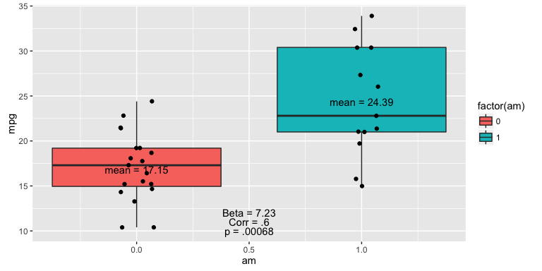
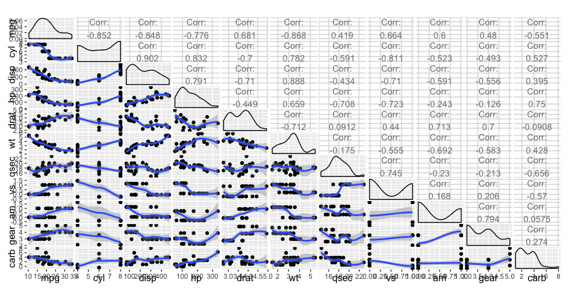
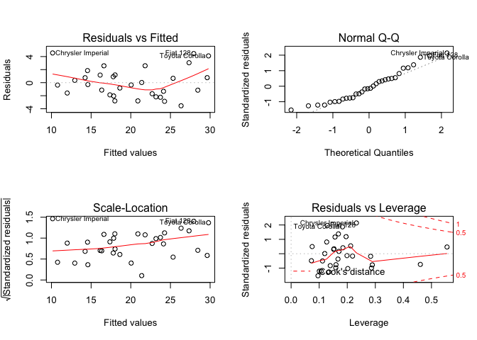

Multivariate Feature Optimization and Model Fitting
================
<a href="http://www.ryantillis.com"> Ryan Tillis </a>
October 18, 2016

<hr>
Synopsis
--------

      In this project we explore the relationship between miles per gallon (MPG) and a set of variables from the Motor Trends car dataset. We are particularly interested in the following two questions:

-   Is an automatic or manual transmission better for MPG?
-   How can we quantify the difference in MPG between manual and automatic transmissions?

      A variety of models are possible, it is quickly apparent that manual is significantly better for gas mileage than automatic. The initial t.test shows this. Specifically quantifying the amount requires accounting for all other regressor while maintaining low variance and high accuracy.

      Adjusted R^2 is a good way to account for the change in variance when adding reggressors. By optimizing our model for adjusted R^2 we arrive at a statistically significant model which accounts the highest percentage of variance and has a lower standard error then one including all variables which achieves a significant P-value.

Hypothesis Testing
------------------

       Below is the outcome of a t.test showing that manual has a significanlty higher mean than automatic for MPG. Therefore, based on this alone we can reliably conclude **manual transmission is better than automatic** with 95% confidence. The data-splitting is included in the appendix

``` r
t.test(manual$mpg,auto$mpg,alternative = "less")$p.value
```

    ## [1] 0.0006868192



<hr>
Model/feature Selection
-----------------------



       This graph tells us that there is a lot of conflation going on between the variables and we will need to take care to chose the right regressors. We can't assume independence and msut balance variance with model fit.

      To optimize for adjusted R^2 I wrote a code to choose regressors (including am) with the highest adjusted R^2 value. This is an equivalent process of minimizing the standard error for the am variable as a regressor.

-   The fitall model does a good job at capturing most of the variance, however the standard error is quite high and so the results can't reliably be consider significant.
    <hr>

``` r
sumall# fitall <- ln(mpg ~ am + cyl + disp + hp + drat + wt + qsec + vs + gear + carb, mtcars)
```

    ##   Estimate Std. Error    t value   Pr(>|t|)    Adj R^2        R^2 
    ##      2.520      2.057      1.225      0.234      0.807      0.869

<hr>
-   Fitting only one variable yields a significant p-value, but only account for 34% of the variance.
    <hr>

``` r
sum1 # fit1 <- ln(mpg ~ am, mtcars)
```

    ##   Estimate Std. Error    t value   Pr(>|t|)    Adj R^2        R^2 
    ##   7.244939   1.764422   4.106127   0.000285   0.338459   0.359799

<hr>
-   Goldilocks! This optimal fit accounts for almost the same amount of variance as the first model, AND has a significant P-value (for our purpose).
    <hr>

``` r
sumopt # fitopt <- Ln(mpg ~ am + disp + hp + wt + qsec, mtcars)
```

    ##   Estimate Std. Error    t value   Pr(>|t|)    Adj R^2        R^2 
    ##     3.4705     1.4858     2.3358     0.0275     0.8375     0.8637

Conclusions
-----------

Our investigation concludes based on this data that **manual transmissions are more efficient than automatic by an average of 3.407 MPG holding all other variables constant**. The model appears to have some level of homoscedasticity with outliers being the Corolla, Fiat 128, and Chrysler Imperial. All performing above predicted values
<hr>
Appendix
--------



Required Data and packages

``` r
require(datasets); require(plyr); require(ggplot2); 
require(GGally);require(car);data(mtcars);attach(mtcars)
```

Splitting data for t.tests and aggregation

``` r
auto <- mtcars[which(am==1),]
manual <- mtcars[which(am==0),]
```

T.Test

``` r
t.test(manual$mpg,auto$mpg,alternative = "less")$p.value
```

Plot

``` r
g2 <- ggplot(mtcars, aes(y=mpg,x=am)) + geom_boxplot(aes(fill=factor(am))) + annotate("text", x = .5, y = 10, label = c("p = .00068"))+ geom_jitter(width = 0.2)+ annotate("text", x = 0, y = 16.85, label = c("mean = 17.15"))+ annotate("text", x = 1, y = 24.39, label = c("mean = 24.39")) + annotate("text", x = .5, y = 11, label = c("Corr = .6")) + annotate("text", x = .5, y = 12, label = c("Beta = 7.23"))

g2
```

Plot2 Pairwise

``` r
pair_loess <- function(data, mapping, method="loess", ...){
       p <- ggplot(data = data, mapping = mapping) + 
              geom_point() + 
              geom_smooth(method=method, ...)
       p
}

g <- ggpairs(mtcars, lower = list(continuous=pair_loess))
```

Extracting useful info for presenting model features

``` r
options(digits=3)

fitall <-lm(mpg~.,mtcars)
fit1 <- lm(mpg~am,mtcars)
fitopt <- df[[memdex]]

sumopt <- append(summary(df[[memdex]])$coef[2,],c(summary(df[[memdex]])$adj.r.squared, summary(df[[memdex]])$r.squared))
names(sumopt)[5:6] <- c("Adj R^2", "R^2")

sumall <- append(summary(fitall)$coef[2,],c(summary(fitall)$adj.r.squared, summary(fitall)$r.squared))
names(sumall)[5:6] <- c("Adj R^2", "R^2")

sum1 <- append(summary(fit1)$coef[2,],c(summary(fit1)$adj.r.squared, summary(fit1)$r.squared))
names(sum1)[5:6] <- c("Adj R^2", "R^2")
```

Optimizing standard error for am estimated coefficient

``` r
fitmem = {0}
memdex = {0}
       #Removing mpg and am from regressor list since they are necessary for our purposes
       regressors <- names(mtcars)[c(2:8,10:11)]
       
       #Generating a binary matrix for using each regressor or not in a grid matrix
       usematrix <- expand.grid(c(TRUE,FALSE), c(TRUE,FALSE),
                             c(TRUE,FALSE), c(TRUE,FALSE),c(TRUE,FALSE), c(TRUE,FALSE),
                             c(TRUE,FALSE), c(TRUE,FALSE)) 
       
       #Creates a list of all possible regressor cominations, there are 256
       Models <- apply(usematrix, 1, function(x) as.formula(paste(c("mpg ~ am", regressors[x]), collapse=" + ")))
       #Applies linear models to all of the possible functions and stores in list
       df <- lapply(Models,lm,data =mtcars)
       
       #Loops over the list storing the max value for adjusted R^2 and the corresponding index
       for (i in 1:256){
              if (summary(df[[i]])$adj.r.squared > fitmem) {
                     fitmem <- summary(df[[i]])$adj.r.squared
                     memdex <- i
              } 
              fitmem
              memdex
       }
```
